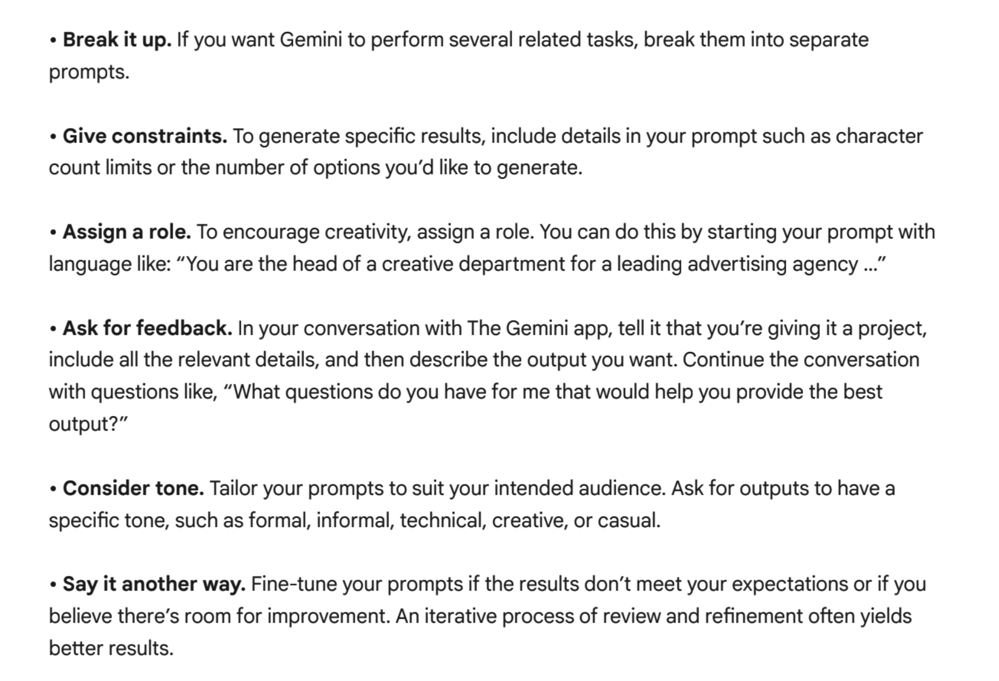
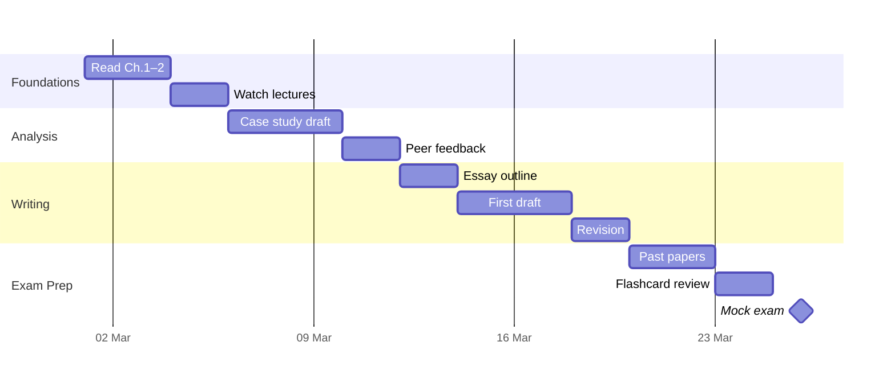
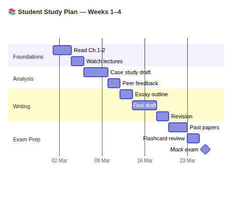

# Human-Led, <br>AI-Supported 🚀

## Practical Tips for Students$^*$

<div class="v4"></div>

###### John Hill
###### Principal Academic, Economics <br>Lead for Digitally-Enhanced Learning
###### February 2026

<div class="v4"></div>

<div class="footer">

$^*$The use of AI during coursework must be **expressly permitted** by your module leader. This demonstration is not a substitute for that permission.

  </div>

---

# Getting in touch :wave:

Email: `j.hill@herts.ac.uk`

Office: [M316🌍](https://maps.herts.ac.uk/poi/3421)

Drop in any time/day
Email ahead to confirm that I'm there
<br>
*<div style="text-align: right">This is what Google Gemini thinks my office door looks like 🤣 👉</div>*


---
# Coming up


<div class="columns">
<div>

1. When can LLMs help?
2. Strengths and Weaknesses of LLMs 
3. What is prompting?
4. Building a strong prompt 
5. Non-Generative Uses of LLMs 🤯 

</div>
<div>

6. Organising that folder of PDFs
7. ⚡️Power Users: diagrams from `text`
8. ⚡️Power Users: `` `code` `` blocks
9. ⚡️Power Users: tables as `text`
10. UH Guidance, and Ethical Use of AI

</div>
</div>


---
# Assuming only free tier access

<br>

 $\qquad$

 $\qquad$

<div class="v2"></div>

*Other LLMs are available: Meta, DeepSeek, Grok (X), Perplexity (multiple models)*

*Your university Office 365 account provides free tier access to Copilot, with the added protection of an enterprise privacy policy$^*$ for UH.*

<div class="footer">

$^*$If you are signed into multiple Microsoft profiles (`@outlook.com` personal email), this special privacy policy only applies to your `@herts.ac.uk` profile.

</div>

---

# Why and When?

- AI can help you **think**, **organise**, **check**, and **understand**. 
- It must not replace **your judgement**, **your writing**, or **your academic voice**. 
	- *i.e. how you would use **language**; how you would **explain** a theory/concept; **examples** you would draw on; and how you **speak** when interviewed.*
- Using AI is **optional**, and **not needed** for every task. 
- Use of AI for coursework is **not permitted unless expressly allowed** by your tutor — read the assignment brief, and locate the relevant AI Declaration cover page
- Use AI to **support** learning, not to produce assessable content.
##### **Guiding principle:** *Use AI to think with — not to write for you.*


---
# The Good and Bad of LLMs
<div class="columns">
<div>

### Strengths
✅ Structured programmable tasks
✅ Formative and structured feedback
✅ Socratic dialogue as learning 
✅ Synthesis, especially cross-disciplinary
✅ Semantic search kills gatekeeping (missing technical terminology may be inferred from context and description)
✅ Wide choice of models each with **very** different strengths
✅ Use of `markdown` for structured data

</div>
<div>

### Weaknesses
<span class="hidden">
❌ Will confidently lie you
❌ Will hallucinate before admitting failure
❌ Will even hallucinate code functions
❌ Few models read attachments in full
❌ Few models will limit the scope of their responses to your supplied documents
❌ Free models have very low model context, meaning your earliest instructions may be silently forgotten
❌ **Privacy probably doesn't exist** 🚨
</span> 

</div>
</div>

---
# The Good and Bad of LLMs
<div class="columns">
<div>

### Strengths
✅ Structured programmable tasks
✅ Formative and structured feedback
✅ Socratic dialogue as learning 
✅ Synthesis, especially cross-disciplinary
✅ Semantic search kills gatekeeping (missing technical terminology may be inferred from context and description)
✅ Wide choice of models each with **very** different strengths
✅ Use of `markdown` for structured data

</div>
<div>

### Weaknesses
❌ Will confidently lie you
❌ Will hallucinate before admitting failure
❌ Will even hallucinate code functions
❌ Few models read attachments in full
❌ Few models will limit the scope of their responses to your supplied documents
❌ Free models have very low model context, meaning your earliest instructions may be silently forgotten
❌ **Privacy probably doesn't exist** 🚨

</div>
</div>

---
# Prompting : Asking AI to do something
Prompting is the act of instructing an LLM to perform a task.

A prompt may be a question or set of instructions, and may include attachments.

The quality of a prompt can significantly affect the response received.

LLMs are **incredibly powerful** when prompted well, but **nearly useless** when prompted poorly.

$\quad$🚀 The best prompts are **clear**, **specific**, and **structured**.
$\quad$🚀 The worst prompts are **vague**, **ambiguous**, and **unstructured**.


---
# <!-- fit --> What's wrong with these prompts? 🤔


---

| **Example Prompt** | **What's Wrong?** |
|-------------------------------------------------------------------------------------------|-----------------------------------------------------------------------------------------------------------------------------------------------------------------------------------------------------|
| 1️⃣ “Summarise this.” | <span class="hidden">Too **vague** — no indication of *what* to summarise, for *what audience*, or in *what format* (bullet list, length, key points). This often yields breezy, generic bullet points.</span> |
| 2️⃣ “Help me do my project.” | <span class="hidden">Lacks **context**, clear goal, and structure — *project* could mean anything; no deliverables, deadlines, or constraints are specified. Models will guess at meaning.</span> |


---

| **Example Prompt** | **What's Wrong?** |
|-------------------------------------------------------------------------------------------|-----------------------------------------------------------------------------------------------------------------------------------------------------------------------------------------------------|
| 1️⃣ “Summarise this.” | Too **vague** — no indication of *what* to summarise, for *what audience*, or in *what format* (bullet list, length, key points). This often yields breezy, generic bullet points. |
| 2️⃣ “Help me do my project.” | Lacks **context**, clear goal, and structure — *project* could mean anything; no deliverables, deadlines, or constraints are specified. Models will guess at meaning. |

  
  
---

| **Example Prompt** | **What's Wrong?** |
|-------------------------------------------------------------------------------------------|-----------------------------------------------------------------------------------------------------------------------------------------------------------------------------------------------------|
| 3️⃣ “Make a schedule for my week.” | <span class="hidden">No **context** about *what should be scheduled*, *priorities*, *times*, *constraints*, or *objectives*. Without context, the model will invent details or produce a generic template.</span> |
| 4️⃣ “I'm really struggling and I don't know what to do. I'm so stressed about everything.” | <span class="hidden">**Speak to a real person, not AI**. Reach out to Student Well-Being (available 24/7 via ask.herts.ac.uk), your programme team (work hours), or HAS-Business for academic skills support for coursework.</span> |

    
---

| **Example Prompt** | **What's Wrong?** |
|-------------------------------------------------------------------------------------------|-----------------------------------------------------------------------------------------------------------------------------------------------------------------------------------------------------|
| 3️⃣ “Make a schedule for my week.” | No **context** about *what should be scheduled*, *priorities*, *times*, *constraints*, or *objectives*. Without context, the model will invent details or produce a generic template. |
| 4️⃣ “I'm really struggling and I don't know what to do. I'm so stressed about everything.” | **Speak to a real person, not AI**. Reach out to Student Well-Being (available 24/7 via ask.herts.ac.uk), your programme team (work hours), or HAS-Business for academic skills support for coursework. |


---
# <!-- fit --> 🚀 Prompting that actually works

---
  

# <!-- fit --> CRAFT(*e*)

## __C__ ontext <br>__R__ ole <br>__A__ ction <br>__F__ ormat <br>__T__ arget audience 
## (__e__ xamples, or templates)


---
# Example Prompt 🚀
## __C__ ontext,  __R__ ole,  __A__ ctions

```
Context:
In the context of studying producer theory in intermediate microeconomics. 

Role:
You are a personal tutor helping me to prepare for a test.

Actions:
1) Read and index the attached study materials. Recognise diagrams and equations.
2) Verify that your index is complete and faithful, and
   ask me any questions needed to clarify the scope of this task.
3) Engage me in a Socratic dialogue about producer theory (30 minutes).
4) Create a personalised study plan (2 hours) based on my responses.
5) Produce 10 multiple choice questions drawn from the attached 
   study resources only, including relevant diagrams and equations. 
```

---
# Example Prompt 🚀
## __F__ ormat, __T__ arget audience
```
Format:
- Respond interactively in this chat
- Use tables for my study plan
- Use multiple choice questions to test me interactively, and 
  provide a download of questions/answers afterwards.
- For each MCQ provide feedback on both the correct and incorrect answers,
  including page references/links to my uploaded study materials.

Target:
- A second year undergraduate student studying intermediate 
  economics on a bachelor of economics programme at a British university.
```


---
# Confirmed by Google, in their new prompting guide


<div class="footer">

Source: https://drive.google.com/file/d/1vNeBbxptU91i2gMCCVGAfWKuQgoieXtp/view

</div>


---

# <!-- fit --> OK,<br> if generated text<br> is banned, what<br> else can I do <br>with LLMs ❓


---

# Formative Conversations <br>(...prompting *it* to prompt *you*...)

## As a study advisor...
- Turn readings into **task lists**, **study plans**, **revision schedules**.
- Turn lecture notes into **practice questions**, **flashcards**, **checklists**.
- Ask for **Socratic questions**, not summaries.

	> *"Engage me in a Socratic conversation about [topic X] to develop my understanding..."*

---

# Formative Conversations <br>(...prompting *it* to prompt *you*...)

## As a writing coach...
Paste **your own writing**, and ask AI to:
- Identify **YOUR** claims, evidence/premises, conclusions, gaps in your logic or reasoning, your reliance on explicit and implicit assumptions; 
- Question the strength of **YOUR** reasoning; prompt you towards further research; prompt you to provide additional counterarguments.

🚨 **Help your future self to avoid academic misconduct by instructing AI to not rewrite your prose; it should support you through questioning, and offering formative advice.**


---

# <!-- fit -->What to do with<br> that folder of PDFs ❓

---


---

# <!-- fit --> $\textrm{ }$$\textrm{ }$ 🤣

---

# Did AI actually read your document? *Probably Not*

Generalist LLMs may **skim** long PDFs or **miss content** deep within them.

<div class="v1"></div>

Whereas specialist "RAG" (Retrieval Augmented Generation) models confine their responses to just the information and attachments supplied by you 💪


---
# Overview of document handling

| Feature | NotebookLM (free)🔥 | Claude (free) | ChatGPT (free) | Gemini (free) | Copilot (basic) |
|---|:--:|:---:|:---:|:---:|:---:|
| Upload PDFs | ✓ | ✓ | ✓ (limited) | ✓ | ✓ |
| ... Multiple  | ✓  | ✓ | ✓ (limited) | ✓ | ✓ |
| Persistence  | ✓ | ✗ forgets | ✗ forgets | ✗ forgets | ✗ forgets |
| Confined Response | ✓ | Needs prompting | Needs prompting | Needs prompting | Needs prompting |
| Page refs | ✓ | Partial | Unreliable | Partial | Partial |

<div class="footer">

Free tier limits change frequently — verify before relying on them.

</div>

---

# Google NotebookLM

A RAG tool from Google allowing you to chat with only the information and attachments supplied by you.

<div class="v1"></div>

<div class="columns">
<div>

✅ Responses grounded **only** in your sources — RAG by design, not by prompting

✅ Inline citations back to specific passages

✅ Persistent **notebooks** — upload once, return later

✅ Up to 50 sources per notebook

</div>
<div>

ℹ️ A **folder** of sources you can chat with

ℹ️ Ideal for dissertations, literature reviews, large projects with lots of documents

ℹ️ Each notebook is a reusable collection — one per module, one per assignment

⚠️ "Free" with any personal Google account, *when you accept their terms and privacy policy*.

</div>
</div>


---

# Practical workflow: setting up NotebookLM

<div class="v1"></div>

$\quad$ 1️⃣ $\quad$Go to **notebooklm.google.com** and create a new notebook

$\quad$ 2️⃣ $\quad$Give it a meaningful name — e.g. *"5BUSxxxx Project Literature"*

$\quad$ 3️⃣ $\quad$Upload your study materials or Google Docs as sources

$\quad$ 4️⃣ $\quad$The tool indexes them automatically — check the source panel

$\quad$ 5️⃣ $\quad$Start asking questions — each response cites the sources you supplied

$\quad$ 6️⃣ $\quad$Come back any time — your notebook and sources persist

<div class="v1"></div>

**Think of each notebook as a module folder you can have a conversation with.**

---

# Key takeaways: working with documents

<div class="v1"></div>

1. **Use the right tool** — NotebookLM for persistent, source-scoped research; Claude or ChatGPT for code creation, execution, interactive canvases; Gemini for images and HTML/JS canvases.
2. **Verify before you trust** — make the AI prove it read the whole document
3. **Constrain explicitly** — in general chatbots, tell the AI to use *only* your sources
4. **Test the boundaries** — ask questions outside the documents to check compliance
5. **Request structured output** — tables and comparisons, not essays
6. **You are the writer** — AI can organise information, but critical judgement and writing is your responsibility. *Use AI as your thinking partner, not your ghostwriter.*


---
# <!-- fit -->Power Users ⚡️


---
# ⚡️ Diagrams from text
LLMs can use plaintext drawing languages like `mermaid` to produce mind maps, timelines, gantt charts, and more.

If your discussion involves obvious levels or categories, or nested information, ask the LLM to produce a mind map using `mermaid`. This will produce the code for a diagram that may be rendered using Obsidian or this website:

https://mermaid.live

This is an insanely powerful way to visualise complex topics.

---
# ⚡️ Example: Diagram your study plan
<div class="columns">
<div>

###### Diagram Code (provided by LLM)
````

````

</div>
<div>

###### Diagram (Rendered)


Rendered using https://mermaid.live

</div>
</div>

---

<div class="columns">
<div>

````
Context: 
A 4-week university study plan 
 with tasks organised into sections,
 provided below

Role: 
Act as a Mermaid diagram expert

Action: 
Generate Mermaid gantt chart code
 for my study plan.

Format: 
- Bare Mermaid code only. 
- Use `dateFormat YYYY-MM-DD` 
  as the only directive

Target: 
- Simple and readable
- Minimal syntax
- Suitable for a beginner
````

</div>

<div>

*...continued*

````
| Section      | Task             | Start          | Duration  |
|--------------|------------------|----------------|-----------|
| Foundations  | Read Ch.1-2      | 2025-03-01     | 3d        |
| Foundations  | Watch lectures   | after previous | 2d        |
| Analysis     | Case study draft | 2025-03-06     | 4d        |
| Analysis     | Peer feedback    | after previous | 2d        |
| Writing      | Essay outline    | 2025-03-12     | 2d        |
| Writing      | First draft      | after previous | 4d        |
| Writing      | Revision         | after previous | 2d        |
| Exam Prep    | Past papers      | 2025-03-20     | 3d        |
| Exam Prep    | Flashcard review | after previous | 2d        |
| Exam Prep    | Mock exam        | 2025-03-26     | milestone |
````

</div>

---
# ⚡️ Code Chunks
Submit code chunks to an LLM by surrounding them in a  ` ``` `  code fence. 

Your keyboard contains a backtick symbol `` ` `` which is not an apostrophe.

<br>

````
```r
# this is my R code chunk
read.csv(data/mydata.csv)
```
````

---
# ⚡️ Tables as text
If your LLM can't work with spreadsheet files, ask it to work in `markdown` tables instead. 

These are known as "pipe tables" because columns of plain text are separated by `|`.  

Use this website to convert between Excel, html and `markdown` tables: https://www.tablesgenerator.com/markdown_tables

```
| Header1 | Header2 | Header3 |
|---------|---------|---------|
| Row1    | Row1    | Row1    |
| Row2    | Row2    | Row2    |
```


---

# <!--fit--> 🚨 Important Advice

---

<div class="columns">
<div>

1️⃣ **All LLMs can hallucinate**
> Older (often free) models hallucinate more; hallucination is a creativity feature, not a bug

> Research tools aim for an hallucination tolerance of 0/10

> But general LLMs usually tolerate 5/10, which is either **very creative** or **very dangerous** depending on your needs 🤣

</div>

<div>
<span class="hidden">
2️⃣ **Hallucinations in code are easy to spot (code will fail), but hallucinations in academic research are much harder for you to spot**
> Fake (non-existent) references, fake citations, and fake quotes are serious academic integrity offences</span>

<br>
<span class="hidden">
3️⃣ **Do not rely on generative text or generative citations, ever**</span>

<span class="hidden">
> "Safer" AI-powered research tools include Scopus AI, Scite.ai and LitMaps.com, but check them too.
</span>

</div>


---

<div class="columns">
<div>

1️⃣ **All LLMs can hallucinate**
> Older (often free) models hallucinate more; hallucination is a creativity feature, not a bug

> Research tools aim for an hallucination tolerance of 0/10

> But general LLMs usually tolerate 5/10, which is either **very creative** or **very dangerous** depending on your needs 🤣

</div>

<div>

2️⃣ **Hallucinations in code are easy to spot (code will fail), but hallucinations in academic research are much harder for you to spot**
> Fake (non-existent) references, fake citations, and fake quotes are serious academic integrity offences

<br>
3️⃣ **Do not rely on generative text or generative citations, ever**

> "Safer" AI-powered research tools include Scopus AI, Scite.ai and LitMaps.com, but check them too.

</div>


---
# ✅ UH Resources on the Safe & Ethical Use of AI

### https://go.herts.ac.uk/academic-skills > Units > AI and Your Studies

### https://go.herts.ac.uk/libraryskillup > Units > Artificial Intelligence

### https://ask.herts.ac.uk/ai-tools

